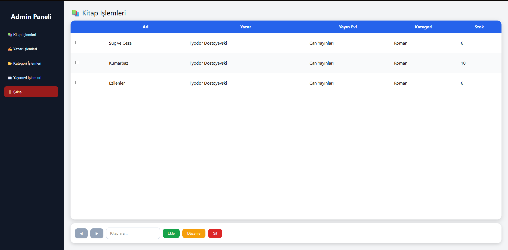
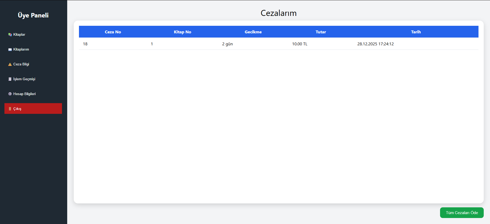
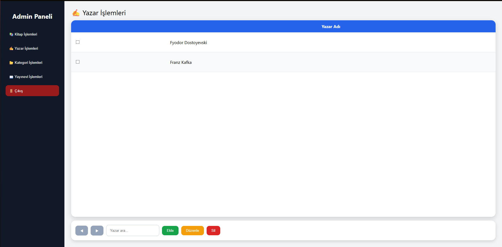
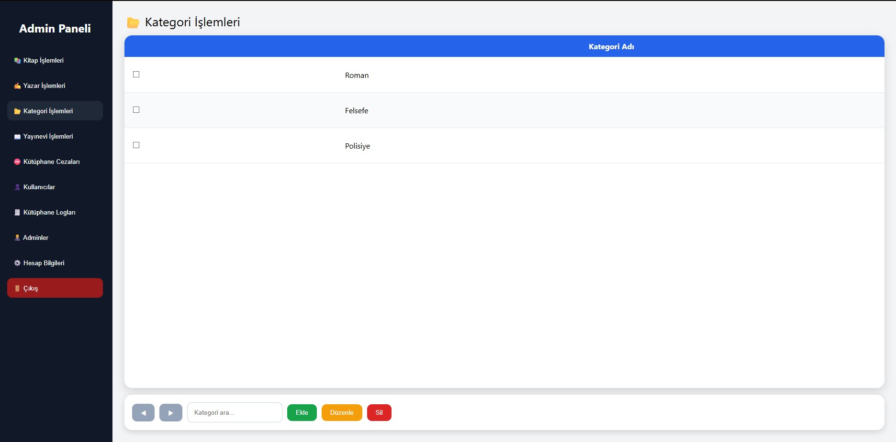
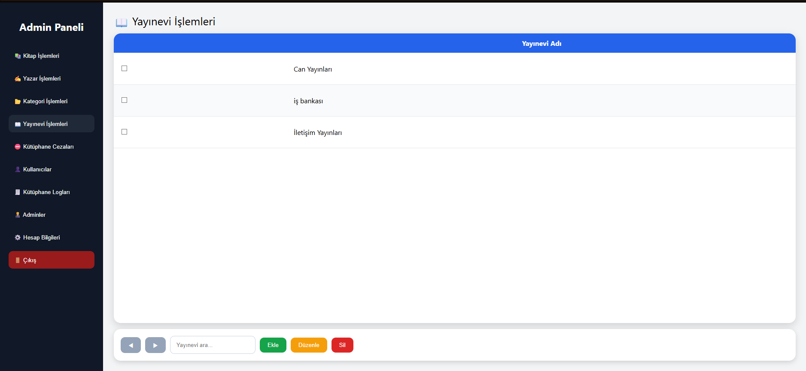
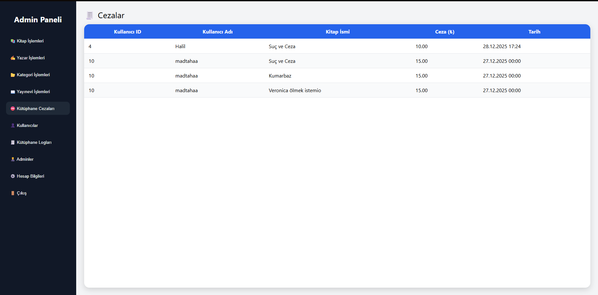
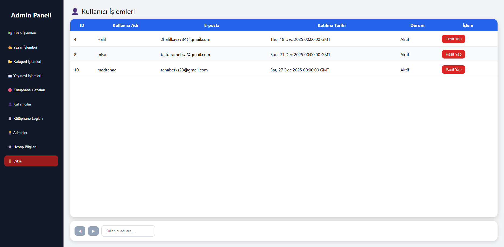
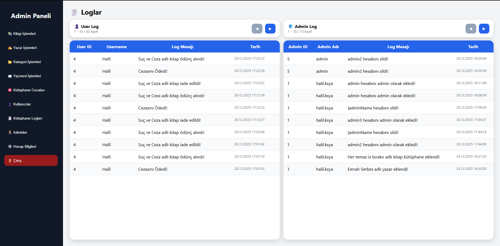

# 
Kütüphane Sistemi

## İçindekiler
- [Proje Ön Bilgi](#proje-ön-bilgi)
- [Kullanılan Teknolojiler](#kullanılan-teknolojiler)
- [Sayfa Görünümü](#sayfa-görünümü)  
- [ER Diyagramı](#er-diyagramı) 
- [Rapor](#rapor)

## Proje Ön Bilgi
- Bir kütüphanenin işlevlerini kapsayan arayüzlü bir websitesi projesidir. 
- Yapılan işlemler veri tabanında tutularak daha tutarlı ve kullanışlı bir sistem oluşturulmuştur.
- Bir kullanıcının kütüphanede yapabileceği işlevler kapsamaktadır(Örneğin: Ödünç alma, iade etme).

## Kullanılan Teknolojiler
- Kullanılan teknolojiler 3 alt başlıkta inceleyeceğiz.

### Backend
- Backend tarafında Python kütüphanesi olan Flask tercih edilmiştir.
- REST API uygun katmanlı mimari uygun hazırlanmıştır. 4 katmanımız vardır.

#### Backend Katmanları
- Model: Veri tabanından verileri nesneye çevirdiğimiz katmandır. Backend tarafında verileri kullanmamızda daha rahat etmemizi sağlar.
- Repository: Veri tabanına CRUD işlemlerini yaptığımız katmandır. Bu katmanda veri tabanında ekleme, silme, sorgulama işlemleri yapılır.
- Service: İş kurallarının olduğu katmandır. İş kurallarına uygun olarak repository çağırır.
- Routes: Frontend tarafından gelen endpointleri backend tarafında çalışmasını sağlarlar. Böylelikle backend ile frontend arasında bağlantı oluşur.

#### Kullanılan Kütüphaneler
- Flask: Websitesinin backend için kullanılmıştır. Projenin temelini oluşturur.
- flask_jwt_extended: JWT kimlik doğrulamaları için kullanılmıştır.
- werzeug.security: Şifreleme ve kontroller için kullanılmıştır.
- mysql.connector: Veri tabanı bağlantısı için kullanılmıştır.
- Date: Tarih, saat gibi işlevler için kullanılmıştır.
- Json, Jsonify: Veri dönüşleri ve hata mesajları için kullanılmıştır.

### Frontend
- Frontend katmanında HTML, CSS ve JavaScript kullanılmıştır.
- endpointler tanımlanmıştır. Bu endpointlerle backend istekler gönderilir.
- Sayfa görünümlerini görmek için [buraya](#sayfa-görünümü) tıklayabilirsiniz!

### Veri Tabanı
- Veri tabanında MySQL kullanılmıştır.
- Veri tabanında tablolar tanımlanmıştır. Tablolar NF kurallarına uygun şekilde tanımlanmıştır.
- Trigger, event kullanılmıştır. Ceza gibi durumlarda event belirli sürede kontrol ederken trigger evente göre ceza tablosuna ekler.

## Sayfa Görünümü

### Giriş Üye Sayfası:

- Kullanıcı bilgilerini girip **üye panele** geçiş sağlayan sayfadır. 
- Kullanıcı eğer bilgileri yanlış girerse **uyarı verir.**
- Eğer admin kullanıcının **durumunu(status)** pasif yapmışsa, durum **aktif olana kadar giriş yapamaz!**

### Giriş Admin Sayfası:

- Admin bilgilerini girip **admin panele** geçiş yapan sayfadır.
- Eğer bilgiler doğru değilse giriş yapmaz ve uyarı verir.

### Giriş Kayıt Ol Sayfası:

- Kayıt olmanızı sağlayan sayfadır.
- Eğer kayıt olacağınız mail zaten kayıtlıysa izin vermez.

### Üye Panel Sayfası:

- Üyenin işlemlerinin yapacağı ana paneldir.
- Toplam 6 buton vardır. Kitaplar, kitaplarım, ceza bilgi, işlem geçmişi, hesap bilgisi ve çıkış mevcuttur.

### Kitaplar Sayfası:

- Database kitapları gösterir. 
- Sayfada en fazla 10 tane kitap gösterir. Önceki ve Sonraki butonlarıyla diğer kitaplara ulaşabilirsiniz. 
- Arama yerinde kitap adıyla arama yapabilirsiniz! 
- Bir üye en fazla 3 tane kitap ödünç alabilir. Fazlasına izin vermez! 
- Ödünç alınnan kitapların stokları düşer. Stok sayısı 0 olan kitaplar gözükmez!
- Eğer ödenmemiş cezanız varsa kitap ödünç almanıza izin vermez! Cezanızı ödemeniz gerekir.

### Kitaplarım Sayfası:

- Ödünç alınan kitapları gösterir. Kitaplar hakkında bilgileri görebilir ve iade edebilirsiniz. 
- İade edildiğinde stokta kitap sayısı artar.

### Cezalarım Sayfası:

- İade süresi geçmiş olan kitaplar için ceza oluşur. Her gün fiyat artar.
- Butonla bütün cezalarınızı ödeyebilirsiniz.
- Ceza ödemeden kitap ödünç alma veya hesap silme gibi özelliklerinizi ödeyene kadar kaybedeceksiniz.

### İşlem Geçmişi Sayfası:

- Kullanıcı işlem geçmişi sayfasından önceden yapmış olduğu işlemleri (loglara) bakabilir. 
- Loglar ayrı bir tabloda tutulur. 
- Kullanıcı hesabını silse de log tablosunda veri kaybı olmadan bilgiler kalır.

### Hesap Bilgisi Sayfası:

- Kullanıcı kendi hesap bilgilerini görebilir, kullanıcı ismini, emailini ve şifresini değiştirebilir. Ve hatta hesabı silebilir. 
- Eğer hesapta iade edilmemiş kitap ya da cezası varsa önce bunları ister.
- İsim değişikliğinde logdaki isim de otomatik değişir. Ve loga bilgi gider.

### Admin Panel Sayfası:

- Adminin işlemlerini yapabileceği paneldir.
- 10 buton bulunur.

### Admin Kitap İşlemleri Sayfası:

- Kütüphane kitaplarını gösterir. 
- Kitaplarda arama, ekleme, düzenleme ve silme yapılabilir. 
- Eğer bi kitap bir üyeye ödünç verilmişse o kitap iade edilene kadar kitap silinemez!

### Admin Kitap İşlemleri Kitap Ekle:

- Kitap ekleme arayüzüdür.
- Kitap bilgileri seçilerek kitap eklenir.

### Admin Kitap İşlemleri Kitap Düzenleme:

- Kitap düzenleme arayüzüdür. 
- Checkbox seçilen sadece bir kitaba düzenleme yapar.
- Kitaba ait bilgiler hazır gelir.

### Admin Yazar İşlemleri Sayfası:

- Kütüphanedeki yazarları gösteren arayüzdür. 
- Yazar arama, ekleme, düzenleme ve silme yapılır. 
- Eğer yazarın bir kitabı varsa o kitap silinmeden silinemez!

### Admin Yazar İşlemleri Yazar Ekle:

- Yazar ekleme arayüzüdür.

### Admin Yazar İşlemleri Yazar Düzenleme:

- Yazar düzenleme arayüzüdür. 
- Checkbox seçilen sadece bir yazar düzenleme yapar. 
- Yazar adı hazır gelir.

### Admin Kategori İşlemleri Sayfası:

- Kütüphanedeki kategorileri gösterir. 
- Kategori arama, ekleme, düzenleme ve silme yapılabilir. 
- Eğer o kategoriye ait bir kitap varsa silinemez!

### Admin Kategori İşlemleri Kategori Ekle:

- Kategori ekleme arayüzüdür.

### Admin Kategori İşlemleri Kategori Düzenleme:

- Kategori düzenleme arayüzüdür. 
- Checbox seçilen sadece bir kategori düzenleme yapar. 
- Kategori adı hazır gelir.

### Admin Yayınevi İşlemleri Sayfası:

- Kütüphanedeki yayınevlerini gösterir. 
- Yayınevi arama, ekleme, düzenleme ve silme yapılabilir. 
- Eğer o yayınevi ait kitap varsa silinemez!

### Admin Yayınevi İşlemleri Yayınevi Ekle:

- Yayınevi ekleme arayüzüdür.

### Admin Yayınevi İşlemleri Yayınevi Düzenleme:

- Yayınevi düzenleme arayüzüdür. 
- Checbox seçilen sadece bir yayınevi düzenleme yapar. 
- Yayınevi adı hazır gelir.

### Kütüphane Cezaları Sayfası:

- Kütüphanedeki bütün cezaları gösterir.

### Kullanıcılar Sayfası:

- Kütüphanedeki kullanıcıların bilgilerini gösterir.
- Kullanıcıların durumlarını aktif veya pasif çevirebilirsiniz.
- Pasif çevrilen kullanıcılar sisteme giriş yapamazlar.

### Kütüphane Logları Sayfası:

- Kütüphanedeki kullanıcı ve adminlerin loglarını gösterir.

### Adminler Sayfası:
- Bütün adminleri gösterir.
- Admin ekleyebilir ve silebilirsiniz.
- Varsayılan admin silinemez.

### Adminler Sayfası Admin Ekle:

- Admin bilgilerini girip admin ekleyebileceğiniz panel açılır.

### Hesap Bilgileri
- Hesap bilgilerinin olduğu sayfadır.
- Hesap bilgilerini düzenleyebilir, şifre değiştirebilirsiniz.
- Hesabınızı silmek istediğinizde buradan silebilirsiniz.

## ER Diyagramları

- Varlıkların birbiriyle ilişkilerini gösteren bir diyagramdır. Birbirleriye ilişkileri düzgünce gösterilmiştir.

### ER Diyagramları Tablo

- Tablo ile gösterilmiş halidir.

### Rapor
- Savunma raporunu buradan ulaşabilirsiniz! 
- [Rapor](445891_Halil_Kaya.pdf)
