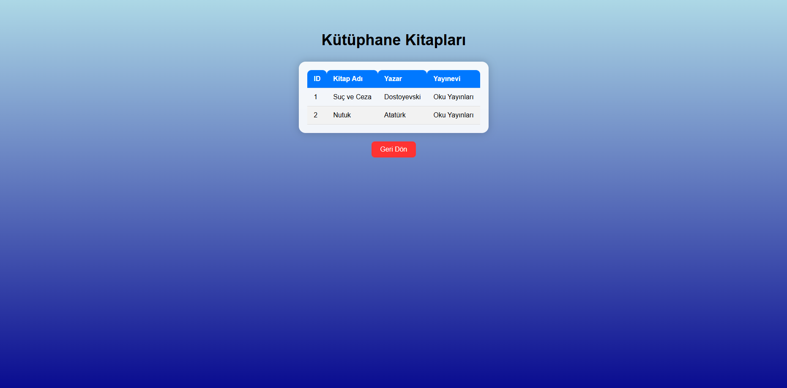

# 
Kütüphane Ödevi(Yapım Aşamasında)

## Yenilikler (08.12.25)
- Kitaplar sayfasına kitapları aramak için arama yeri, ödünç almak için radiobox, ödünç butonu (sadece endpoint veriyor şuanlık backend tarafı yapılmadı daha) ve sayfada ileri ve geri butonları eklendi!
- Arama butonuna göre eşlenenler otomatik olarak sıralanıyorlar.
- Sayfada 10 tane kitap gözüküyor. Kalanı diğer sayfalarda butona basarak gösteriliyor.
- Bazı html sayfalarında ufak düzenlemeler yapıldı.
- Database tarafında kitaplar tablosu daha düzenli, ek özellikler ve ingilizce halde düzenlendi!

## İçindekiler
- [Sayfa Görünümü](#sayfa-görünümü)  
- [ER Diyagramı](#er-diyagramı)  

## Sayfa Görünümü
- **NOT:** En son hali değildir. Proje bitene kadar değişiklikler olabilir. Bunlar şuanki yaptıklarım ve üstüne koyup ya da değiştirip daha iyisini yapacaklarımdır.
### Giriş Üye Sayfası:

- Kutucukların içine veri yazılıp butona basınca üye panel yönlendiriyor. Artık bilgiler doğruysa üye panel geçiş sağlar. Değilse geçiş olmaz.

### Giriş Admin Sayfası

- Üye ile aynı işlevlere sahip. Doğruysa admin panele ulaşırsınız.

### Giriş Kayıt Ol Sayfası

- Kayıt olmak için olan sayfadır. Aynı login.html içindedir. Aynı mail varsa kaydetmez! Yoksa kaydeder ve üyeden giriş yapabilirsiniz!

### Üye Panel Sayfası

- Üyenin işlemlerini yapacağı paneldir. Şuanlık 5 buton var. Şuanlık sadece Kitaplar ve Çıkış butonu çalışmaktadır.

### Kitaplar Sayfası

- Database kitapları gösterir. Geri dön butonları çalışır. İlerde eklemeler yapılacaktır.

### Admin Panel Sayfası

- Admin işlemlerini yaptığı paneldir. Butonlar sonradan ekleme ya da düzenleme yapılabilir. Bunda da şuanlık sadece çıkış butonu çalışmaktadır.

## ER Diyagramı

- Daha iyi bir ER diyagramı. Yeni şeyler eklendikçe daha da güzel ve düzenli olacaktır.

## Kapanış

- Bi sonraki committe muhtemelen ödünç al butonu işlevsel hale getirme, admin giriş sayfasını daha farklı yere koyma ve database ek değişiklikler üzerine olacaktır.